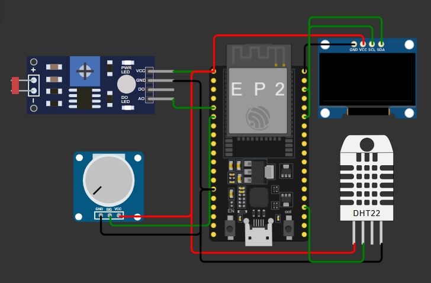
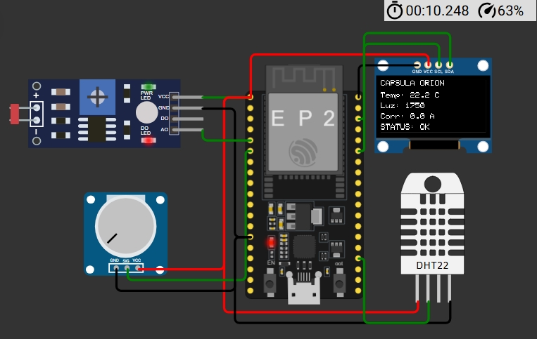
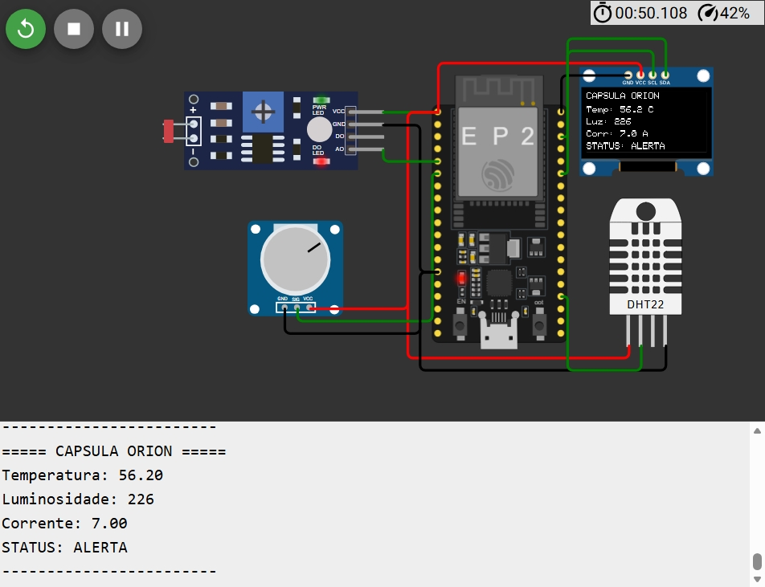

# Monitoramento da Cápsula Órion com ESP32

## Sobre o Projeto

Este projeto simula um sistema de monitoramento para a cápsula espacial Órion utilizando conceitos de Internet das Coisas (IoT) e sistemas embarcados.

A solução foi desenvolvida na plataforma Wokwi com um microcontrolador ESP32 responsável pela aquisição, processamento e exibição de dados em tempo real.

O sistema monitora continuamente três grandezas físicas consideradas críticas para o funcionamento da cápsula:

* Temperatura
* Luminosidade
* Corrente elétrica (simulada por potenciômetro)

---

## Simulação Online

🔗 Acesse o projeto no Wokwi:

https://wokwi.com/projects/465633087304446977

---

## Estrutura do Projeto

```text
monitoramento-capsula-orion/
│
├── assets/
│   ├── circuito_orion.jpeg
│   ├── oled_funcionando.jpeg
│   └── simulacao.jpeg
│
├── codigo/
│   ├── diagram.json
│   └── monitora_orion.ino
│
└── README.md
```

---

## Imagens do Projeto

### Circuito no Wokwi



### Display OLED em Funcionamento



### Simulação Completa



---

## Componentes Utilizados

| Componente                   | Quantidade |
| ---------------------------- | ---------- |
| ESP32 DevKit V1              | 1          |
| Sensor DHT22                 | 1          |
| Sensor de Luminosidade (LDR) | 1          |
| Potenciômetro                | 1          |
| Display OLED SSD1306 128x64  | 1          |

---

## Configuração dos Pinos

| Componente                  | Pino ESP32 |
| --------------------------- | ---------- |
| DHT22 (DATA)                | GPIO15     |
| Sensor de Luminosidade (AO) | GPIO34     |
| Potenciômetro (SIG)         | GPIO35     |
| OLED SDA                    | GPIO21     |
| OLED SCL                    | GPIO22     |

Todos os componentes foram alimentados com 3.3V e conectados ao GND comum do ESP32.

---

## Funcionamento

O ESP32 realiza leituras contínuas dos sensores conectados ao sistema.

Os valores coletados são processados e exibidos em tempo real no display OLED, permitindo o monitoramento das condições operacionais da cápsula Órion.

As variáveis monitoradas são:

* Temperatura interna da cápsula;
* Intensidade luminosa do ambiente;
* Corrente elétrica simulada.

Além da exibição dos valores, o sistema avalia limites operacionais pré-definidos e informa se a cápsula está operando dentro das condições esperadas.

---

## Resultados Obtidos

O sistema foi capaz de:

* Monitorar temperatura em tempo real utilizando o sensor DHT22;
* Medir a intensidade luminosa através do módulo LDR;
* Simular leituras de corrente elétrica utilizando um potenciômetro;
* Exibir todas as informações em um display OLED SSD1306;
* Processar os dados continuamente utilizando o ESP32;
* Simular um cenário de monitoramento aplicado ao contexto aeroespacial.

---

## Tecnologias Utilizadas

* C++
* ESP32
* Wokwi
* OLED SSD1306
* DHT22
* Sensores Analógicos

---

## Conceitos Aplicados

* Internet das Coisas (IoT)
* Sistemas Embarcados
* Monitoramento em Tempo Real
* Aquisição de Dados
* Sensoriamento Ambiental
* Simulação Eletrônica

---

## Autores

| Nome                                  | RM     |
| ------------------------------------- | ------ |
| Mateus de Oliveira Fernandes Neves    | 572431 |
| Marcelo do Nascimento Batista Pereira | 569410 |
| Nathan Hiroshi Watanabe               | 572806 |

---

Projeto desenvolvido para fins acadêmicos, demonstrando a integração entre sensores, sistema embarcado e interface de visualização para monitoramento da cápsula Órion.
